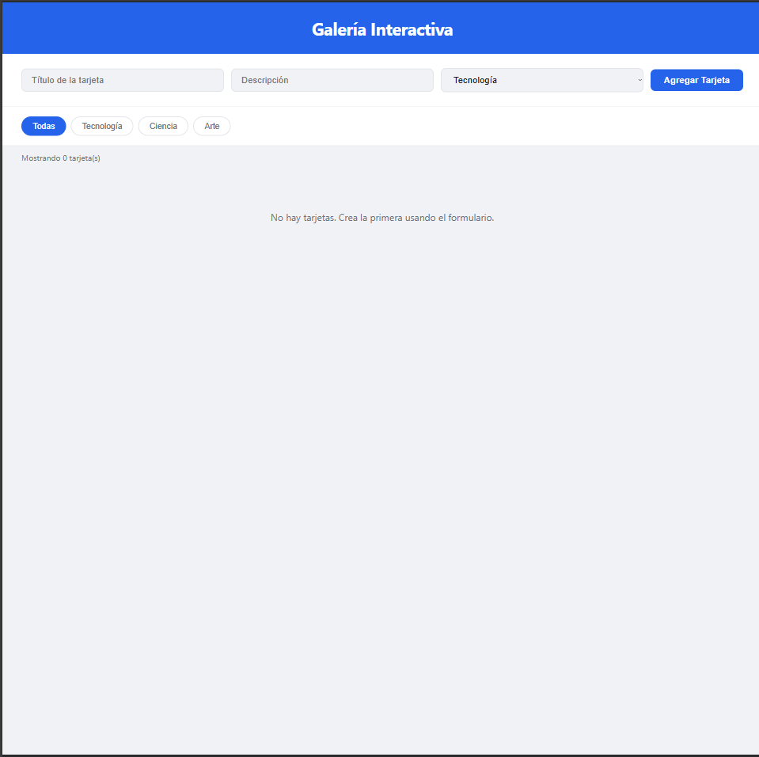
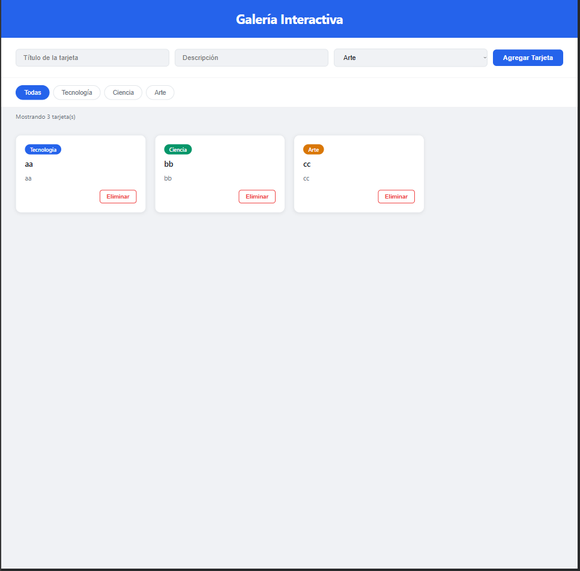
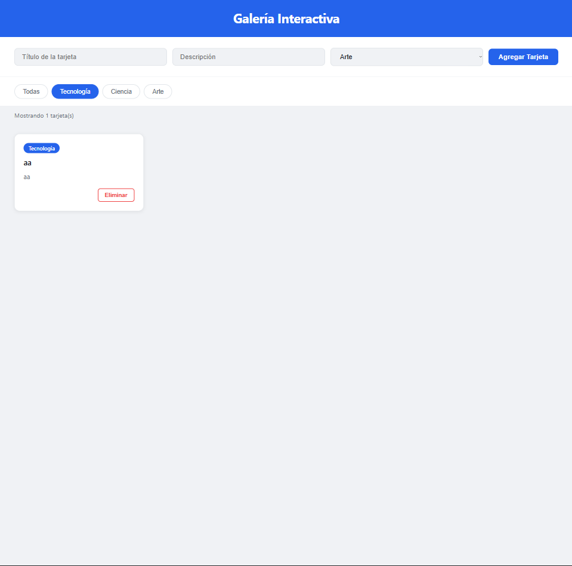

# Galería Interactiva - JavaScript

**Nombre:** Abrahan Remolina Bolívar  
**Código:** 02230131004  

## Descripción

Este proyecto consiste en el desarrollo de una galería interactiva utilizando JavaScript, en la cual se pueden gestionar tarjetas dinámicamente mediante manipulación del DOM y manejo de eventos.

La aplicación permite crear, eliminar y filtrar elementos en tiempo real, ofreciendo una experiencia dinámica e interactiva para el usuario.

## Funcionalidades

- Creación de tarjetas con título, descripción y categoría  
- Eliminación de tarjetas de forma dinámica  
- Filtrado de tarjetas según su categoría  
- Contador de tarjetas visibles  
- Mensaje cuando no hay elementos disponibles  

## Tecnologías utilizadas

- HTML5  
- CSS3  
- JavaScript (ES6)  
- DOM API  

## Cómo ejecutar el proyecto

1. Clonar o descargar el repositorio.  
2. Abrir la carpeta en Visual Studio Code.  
3. Ejecutar el proyecto con Live Server.  
4. Abrir el archivo `index.html`.  

## Capturas

### Estructura inicial

### Creación de tarjetas

### filtros

